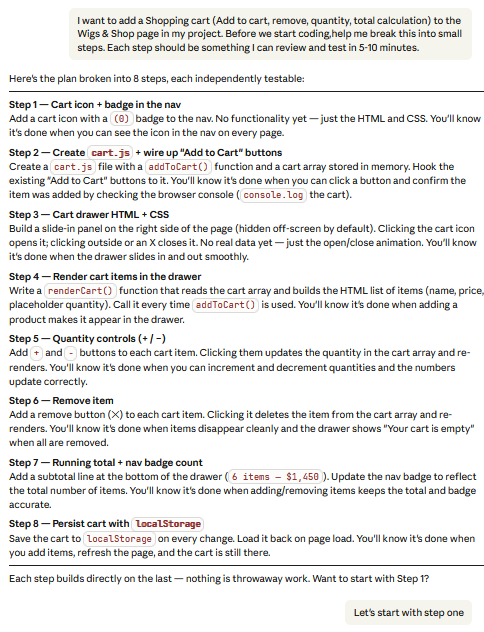

Here's the plan broken into 8 steps, each independently testable:

Step 1 — Cart icon + badge in the nav
Add a cart icon with a (0) badge to the nav. No functionality yet — just the HTML and CSS. You'll know it's done when you can see the icon in the nav on every page.

Step 2 — Create cart.js + wire up "Add to Cart" buttons
Create a cart.js file with a addToCart() function and a cart array stored in memory. Hook the existing "Add to Cart" buttons to it. You'll know it's done when you can click a button and confirm the item was added by checking the browser console (console.log the cart).

Step 3 — Cart drawer HTML + CSS
Build a slide-in panel on the right side of the page (hidden off-screen by default). Clicking the cart icon opens it; clicking outside or an X closes it. No real data yet — just the open/close animation. You'll know it's done when the drawer slides in and out smoothly.

Step 4 — Render cart items in the drawer
Write a renderCart() function that reads the cart array and builds the HTML list of items (name, price, placeholder quantity). Call it every time addToCart() is used. You'll know it's done when adding a product makes it appear in the drawer.

Step 5 — Quantity controls (+ / −)
Add + and − buttons to each cart item. Clicking them updates the quantity in the cart array and re-renders. You'll know it's done when you can increment and decrement quantities and the numbers update correctly.

Step 6 — Remove item
Add a remove button (✕) to each cart item. Clicking it deletes the item from the cart array and re-renders. You'll know it's done when items disappear cleanly and the drawer shows "Your cart is empty" when all are removed.

Step 7 — Running total + nav badge count
Add a subtotal line at the bottom of the drawer (6 items — $1,450). Update the nav badge to reflect the total number of items. You'll know it's done when adding/removing items keeps the total and badge accurate.

Step 8 — Persist cart with localStorage
Save the cart to localStorage on every change. Load it back on page load. You'll know it's done when you add items, refresh the page, and the cart is still there.

